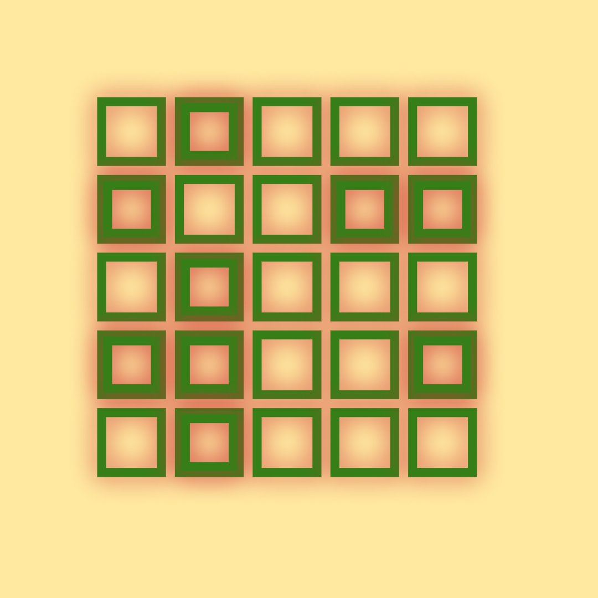
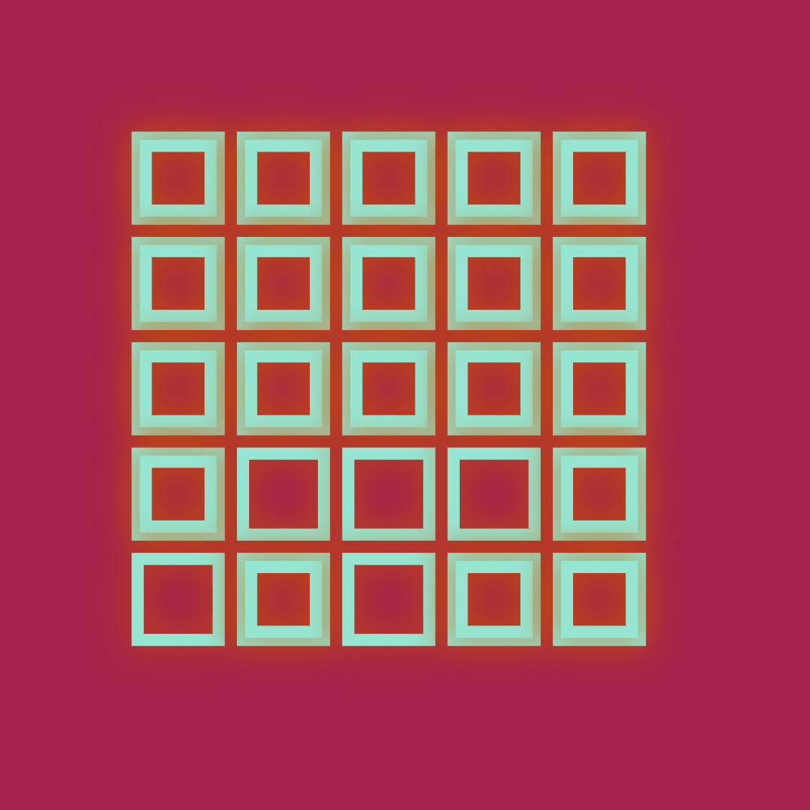
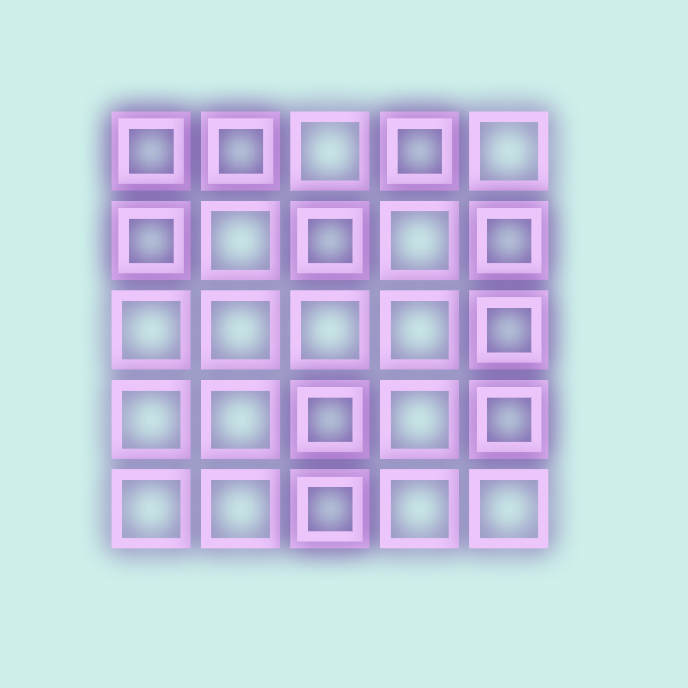
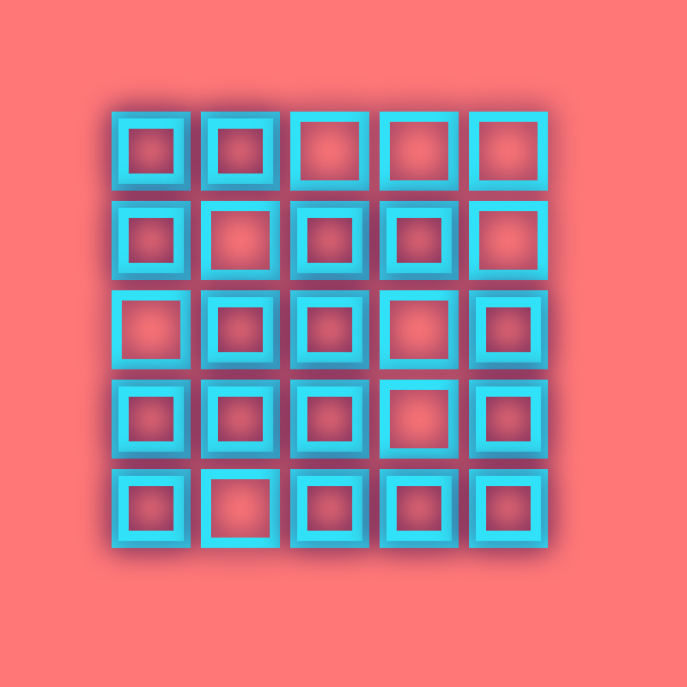
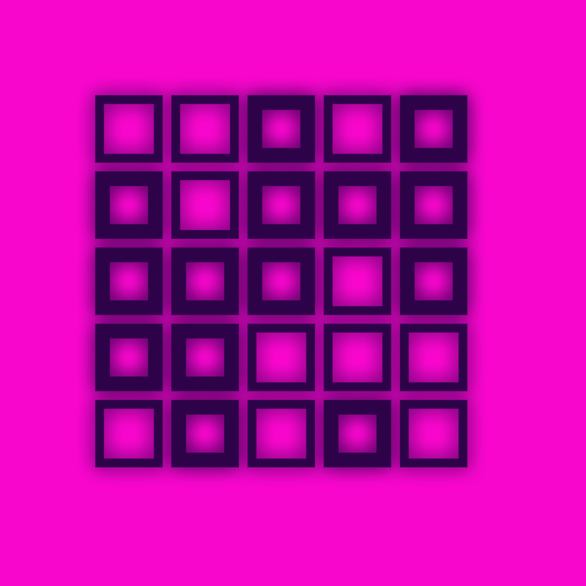
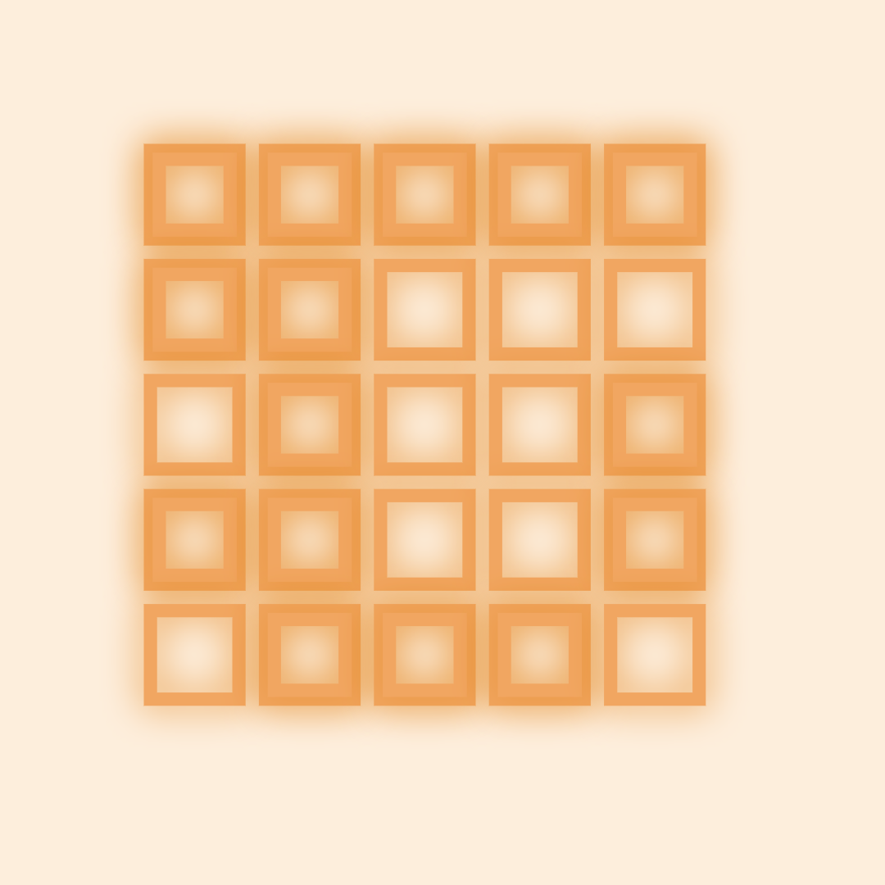

# Project Squared

|                |      |      |
|---------------:|------|-----:|
| [**home**](README.md)|| [watches](watch-faces.md) |

---

## Title: iWrite Pretty Angles

--- 

Dynamically drawing squares with randomized thickness. I experimented with color palettes and shadows to create the illusion of contrasting colors for each square that is randomly "thicker." For example. 

| | | |
|-|-|-|
||||
|||
